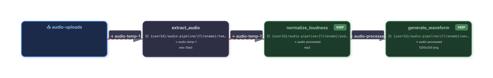
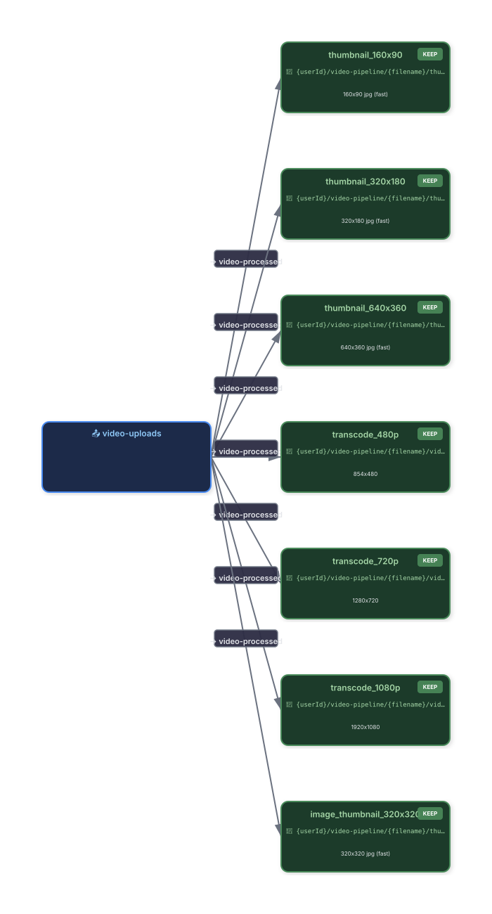
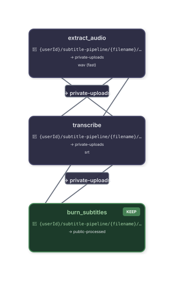
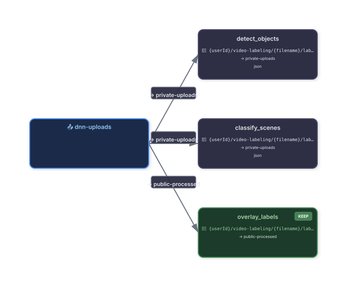
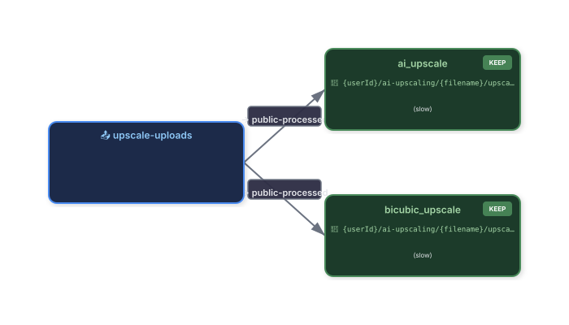

# YAML to Supabase Migration Transpiler for FFmpegLab

A declarative pipeline transpiler that converts a YAML pipeline definition into a PostgreSQL migration for Supabase. It generates idempotent SQL scripts to set up storage buckets, RLS policies, PostgreSQL triggers, and pgmq jobs for automated media processing using FFmpeg.

## Overview

The transpiler reads a YAML file describing a media processing pipeline (video, audio, subtitle generation, DNN labeling, etc.) and produces:

- **Up migration** – creates buckets, RLS policies, and one PostgreSQL trigger per pipeline step.
- **Down migration** – safely removes triggers and policies (buckets are preserved to avoid data loss).
- **Optional SVG graph** – visualizes the pipeline structure and data flow.

It leverages the existing `render` table and `render` pgmq queue from the FFmpegLab server, so no new tables are created.

## Features

- **Declarative pipeline definition** – clean YAML syntax for steps, triggers, and storage.
- **Automatic SQL generation** – idempotent, production‑ready migrations.
- **Pipeline grouping** – all steps share a `pipelineId` and `project` value in the `render` table.
- **Per‑run unique folders** – each pipeline run gets a unique `runId` (customizable via template) to group all outputs.
- **Customizable run ID** – combine `{uuid}`, `{baseFilename}`, and `{timestamp}` in any order.
- **Visual graph** – generate an SVG diagram of your pipeline with `--svg`.
- **Multiple step types** – supports sequential chaining (`next_bucket`) and parallel execution (`keep: true`).
- **Placeholder support** – `{{userId}}`, `{{baseFilename}}`, `{{pipelineId}}`, `{{runId}}` in output paths.
- **Custom FFmpeg commands** – each step defines its own command with `$MEDIA_1` and `$OUTPUT_PATH` variables.
- **Rich editor configuration** – per‑step and global editor settings control encoding parameters.
- **Reusable templates** – reference existing renders or pipelines as templates.
- **Multi‑file triggers** – define pipelines that wait for a set of files to be present before triggering.

## Examples

The `examples/` directory contains ready‑to‑use pipeline templates and their corresponding SVG graphs. Each example demonstrates a different media processing scenario.

| Pipeline | YAML | SVG Graph | Description |
|----------|------|-----------|-------------|
| **Audio Processing** | [`audio.yaml`](./examples/audio.yaml) |  | Sequential podcast audio processing: extract WAV → normalize → waveform PNG. |
| **Video Onboarding** | [`video.yaml`](./examples/video.yaml) |  | Parallel video & image processing: thumbnails + transcodes. |
| **Whisper Subtitles** | [`whisper-subtitles.yaml`](./examples/whisper-subtitles.yaml) |  | AI subtitle generation with Whisper: extract audio → transcribe → burn subtitles. |
| **DNN Labeling** | [`dnn-labeling.yaml`](./examples/dnn-labeling.yaml) |  | Object detection & scene classification using FFmpeg DNN filters. |
| **DNN Upscaling** | [`dnn-upscale.yaml`](./examples/dnn-upscale.yaml) |  | Super‑resolution AI upscaling (SRCNN) + bicubic fallback. |

To generate these graphs yourself, run the transpiler with the `--svg` flag on any YAML file.

## Installation

The transpiler is a single TypeScript file that runs with **Deno**. It has zero external dependencies (except the YAML parser from the Deno standard library and the SVG generator).

```bash
# Download the transpiler and the SVG generator
curl -O https://raw.githubusercontent.com/ffmpeglab/server/main/sdk/yaml/transpiler.ts
curl -O https://raw.githubusercontent.com/ffmpeglab/server/main/sdk/yaml/svg.ts
```

## Usage

```bash
deno run --allow-read --allow-write transpiler.ts <path-to-yaml> [output-dir] [--svg]
```

- `<path-to-yaml>` – the YAML pipeline definition file.
- `[output-dir]` – directory where the SQL and SVG files will be written (default: `./supabase/migrations`).
- `--svg` – generate an SVG diagram of the pipeline.

### Example

```bash
deno run --allow-read --allow-write transpiler.ts examples/video.yaml ./supabase/migrations --svg
```

### Output

```
✅ Migration files created:
   UP:   ./supabase/migrations/20260807120000_video-pipeline.sql
   DOWN: ./supabase/migrations/20260807120000_video-pipeline_down.sql
   SVG:  ./supabase/migrations/20260807120000_video-pipeline.svg
```

## YAML Specification

### Top‑Level Fields

| Field | Type | Description |
|-------|------|-------------|
| `name` | string | Human‑readable name of the pipeline (used in migration filename). |
| `pipelineId` | string | Unique identifier for the pipeline (used as `project` in `render` and folder name). If omitted, it is slugified from `name`. |
| `runId` | object | Configuration for the per‑run unique ID (see below). |
| `description` | string | Optional description. |
| `version` | string | Optional version string. |
| `storage` | object | Storage configuration (buckets, policies, output bucket). |
| `steps` | array | List of processing steps. |
| `render` | object | Render table metadata (project name, initial status, public flag). |
| `editor` | object | Global editor defaults (merged with per‑step editor). |

### `runId` Object

| Field | Type | Description |
|-------|------|-------------|
| `template` | string | Template for the run ID (e.g., `{baseFilename}_{uuid}`). Supports `{uuid}`, `{baseFilename}`, `{timestamp}`. Default: `{uuid}`. |

### `storage` Object

| Field | Type | Description |
|-------|------|-------------|
| `output_bucket` | string | The final bucket where artifacts with `keep: true` are stored. |
| `buckets` | array | List of Supabase Storage buckets to create (idempotent). |
| `rls_policies` | array | Row‑level security policies for `storage.objects`. |

#### `buckets` Item

| Field | Type | Description |
|-------|------|-------------|
| `name` | string | Bucket ID and name. |
| `public` | boolean | Whether the bucket is public. |
| `allowed_mime_types` | array | List of allowed MIME types (optional). |
| `file_size_limit` | number | Maximum file size in bytes (optional). |

#### `rls_policies` Item

| Field | Type | Description |
|-------|------|-------------|
| `name` | string | Unique policy name. |
| `operation` | string | `INSERT`, `SELECT`, `UPDATE`, `DELETE`, or `ALL`. |
| `role` | string | `authenticated`, `anon`, `service_role`, or a custom role. |
| `condition` | string | SQL expression for the policy (e.g., `bucket_id = 'my-bucket'`). |

### `steps` Array

Each step represents a processing stage. The transpiler generates one PostgreSQL trigger per step.

| Field | Type | Description |
|-------|------|-------------|
| `id` | string | Unique step identifier (used in render title). |
| `trigger` | object | Trigger configuration (name, event, table, condition). |
| `command` | string | FFmpeg command arguments (without the `ffmpeg` binary). Placeholders: `$MEDIA_1` (input) and `$OUTPUT_PATH` (output). |
| `inputs` | array | List of input placeholders (e.g., `["INPUT_FILE"]`). |
| `outputs` | array | List of output placeholders (e.g., `["OUTPUT_FILE"]`). |
| `output_path` | string | Destination path with placeholders: `{{userId}}`, `{{baseFilename}}`, `{{pipelineId}}`, `{{runId}}`. |
| `editor` | object | Metadata for the runner (output format, preset, etc.). |
| `next_bucket` | string | Bucket where the output is uploaded (used for chaining). |
| `keep` | boolean | If `true`, the output is sent directly to `storage.output_bucket`; otherwise, it uses `next_bucket`. |
| `template` | string | (Optional) Reference to a previous render (by ID) to use as a template for this step. |
| `source` | string | (Optional) Reference to a media source (e.g., a render output, a public URL, or a stored file key). |
| `wait_for` | array | (Optional) List of file patterns or render IDs that must complete before this step triggers. |

#### `trigger` Object

| Field | Type | Description |
|-------|------|-------------|
| `name` | string | Function and trigger name (unique per step). |
| `event` | string | `INSERT`, `UPDATE`, `DELETE`, or `TRUNCATE`. |
| `table` | string | The table to attach the trigger to (typically `storage.objects`). |
| `condition` | string | SQL `WHEN` condition for the trigger (e.g., `NEW.bucket_id = 'video-uploads'`). |

#### `editor` Object

The `editor` object contains parameters that control the encoding and output. It mirrors the `EditorProjectConfiguration` class in the FFmpegLab server.

| Field | Type | Default | Description |
|-------|------|---------|-------------|
| `width` | number | 0 | Output width (0 = keep original). |
| `height` | number | 0 | Output height (0 = keep original). |
| `length` | number | 0 | Duration in seconds (0 = full duration). |
| `compressionLevel` | number | 23 | Compression level (CRF for x264). |
| `preset` | string | `"medium"` | Encoding preset: `ultrafast`, `superfast`, `veryfast`, `faster`, `fast`, `medium`, `slow`, `slower`, `veryslow`. |
| `output` | string | `"mp4"` | Output format (see `FFMpegOutputType`). |
| `code` | string | (auto‑generated) | Full FFmpeg command (including `ffmpeg` binary). |
| `selectedCode` | string | `"custom"` | Whether to use custom command (`"custom"`) or built‑in template. |
| `framerate` | number | 30 | Frame rate for video output. |
| `aspectRatio` | string | `"16:9"` | Aspect ratio (e.g., `"4:3"`, `"16:9"`). |
| `opacity` | number | 1.0 | Opacity (0.0 – 1.0) for overlays. |
| `start` | number | 0 | Start time in seconds (for trimming). |
| `end` | number | 0 | End time in seconds (for trimming). |
| `outputFilePath` | string | (auto) | Specific output file path (overrides `output_path`). |

**Supported `output` values (`FFMpegOutputType`):**

| Value | Description |
|-------|-------------|
| `mp4` | H.264/AAC MP4 video |
| `gif` | Animated GIF |
| `mp3` | MP3 audio |
| `mov` | QuickTime MOV |
| `avi` | AVI video |
| `mkv` | Matroska MKV |
| `png` | PNG image |
| `jpg` | JPEG image |

### `render` Object

| Field | Type | Description |
|-------|------|-------------|
| `project_name` | string | Deprecated – use `pipelineId` instead. |
| `status` | string | Initial status (e.g., `queued`). |
| `public` | boolean | Whether the render is public. |

## Advanced Features

### Reusing Existing Renders as Templates

You can reference a previous render as a template for a new step using the `template` field. This is useful for applying the same processing pipeline to a new input file.

```yaml
steps:
  - id: "reuse_effect"
    template: "render_123"   # UUID of a previous render
    command: -i $MEDIA_1 -vf "some_filter" -y $OUTPUT_PATH
    inputs: ["INPUT_FILE"]
    outputs: ["OUTPUT_FILE"]
    output_path: "{{userId}}/{{pipelineId}}/{{runId}}/output.mp4"
    keep: true
```

The transpiler will generate SQL that copies the `editor` settings and media configuration from the referenced render, then applies the new command.

### Referencing Media from Other Sources

The `source` field allows you to specify an external media source instead of relying on the trigger's `NEW` object.

```yaml
steps:
  - id: "process_s3_media"
    source:
      bucket: "my-bucket"
      key: "path/to/file.mp4"
    command: -i $MEDIA_1 -c:v libx264 -y $OUTPUT_PATH
    inputs: ["INPUT_FILE"]
    outputs: ["OUTPUT_FILE"]
    output_path: "{{userId}}/{{pipelineId}}/{{runId}}/processed.mp4"
    keep: true
```

The transpiler will generate a trigger that fetches the file from the specified bucket and key.

### Multi‑File Triggers

To trigger a pipeline only when a set of files are present in a folder, use the `wait_for` field. This can list file patterns or render IDs that must complete before the step fires.

```yaml
steps:
  - id: "combine_audio_video"
    wait_for:
      - "*.mp4"      # wait for all MP4 files in the folder
      - "*.wav"      # wait for all WAV files
    trigger:
      name: "handle_combine"
      condition: |
        NEW.bucket_id = 'uploads' AND
        (SELECT COUNT(*) FROM storage.objects WHERE bucket_id = 'uploads' AND name LIKE '%.mp4') > 0 AND
        (SELECT COUNT(*) FROM storage.objects WHERE bucket_id = 'uploads' AND name LIKE '%.wav') > 0
    command: -i $MEDIA_1 -i $MEDIA_2 -c:v libx264 -y $OUTPUT_PATH
    inputs: ["VIDEO_FILE", "AUDIO_FILE"]
    outputs: ["OUTPUT_FILE"]
    output_path: "{{userId}}/{{pipelineId}}/{{runId}}/combined.mp4"
    keep: true
```

The transpiler generates a trigger condition that checks for the presence of all required files before executing.

## Example YAML

Below is a comprehensive example with editor parameters, templates, and multi‑file triggers:

```yaml
name: "Advanced Video Processing"
pipelineId: "advanced-video"
runId:
  template: "{baseFilename}_{uuid}"
description: "Process videos with custom editor settings and multi-file triggers"
version: "1.0.0"

storage:
  output_bucket: "processed"
  buckets:
    - name: "uploads"
      public: false
      allowed_mime_types: ["video/mp4", "audio/wav"]
    - name: "processed"
      public: true
      allowed_mime_types: ["video/mp4", "image/png"]

  rls_policies:
    - name: "Users can upload to their own folder"
      operation: "INSERT"
      role: "authenticated"
      condition: |
        bucket_id = 'uploads' AND
        (storage.foldername(name))[1] = auth.uid()::text

editor:
  width: 1920
  height: 1080
  framerate: 30
  aspectRatio: "16:9"
  compressionLevel: 23
  preset: "medium"

steps:
  - id: "transcode_h264"
    trigger:
      name: "handle_transcode"
      event: "INSERT"
      table: "storage.objects"
      condition: |
        NEW.bucket_id = 'uploads' AND
        NEW.metadata->>'mimetype' LIKE 'video/%'
    command: -i $MEDIA_1 -c:v libx264 -crf $COMPRESSION_LEVEL -preset $PRESET -vf "scale=$WIDTH:$HEIGHT" -c:a aac -b:a 128k -movflags +faststart -f mp4 -y $OUTPUT_PATH
    inputs: ["INPUT_FILE"]
    outputs: ["OUTPUT_FILE"]
    output_path: "{{userId}}/{{pipelineId}}/{{runId}}/transcoded.mp4"
    editor:
      width: 1280
      height: 720
      preset: "slow"
    keep: true

  - id: "add_watermark"
    trigger:
      name: "handle_watermark"
      event: "INSERT"
      table: "storage.objects"
      condition: |
        NEW.bucket_id = 'processed' AND
        NEW.name LIKE '%transcoded.mp4'
    command: -i $MEDIA_1 -i $WATERMARK_IMAGE -filter_complex "[1:v]scale=200:100[wm];[0:v][wm]overlay=10:10" -c:a copy -y $OUTPUT_PATH
    inputs: ["VIDEO_FILE", "WATERMARK_IMAGE"]
    outputs: ["OUTPUT_FILE"]
    output_path: "{{userId}}/{{pipelineId}}/{{runId}}/watermarked.mp4"
    source:
      watermark_image:
        bucket: "assets"
        key: "logo.png"
    keep: true

  - id: "generate_thumbnail"
    trigger:
      name: "handle_thumbnail"
      event: "INSERT"
      table: "storage.objects"
      condition: |
        NEW.bucket_id = 'processed' AND
        NEW.name LIKE '%watermarked.mp4'
    command: -i $MEDIA_1 -vf "thumbnail,scale=320:180" -frames:v 1 -f image2 -y $OUTPUT_PATH
    inputs: ["INPUT_FILE"]
    outputs: ["OUTPUT_FILE"]
    output_path: "{{userId}}/{{pipelineId}}/{{runId}}/thumbnail.jpg"
    editor:
      output: "jpg"
    keep: true

render:
  project_name: "advanced-video"
  status: "queued"
  public: false
```

## Output Files

- **`{timestamp}_{name}.sql`** – Up migration.
- **`{timestamp}_{name}_down.sql`** – Down migration.
- **`{timestamp}_{name}.svg`** – Pipeline graph (when `--svg` is used).

## Requirements

- [Deno](https://deno.com/) (v1.30 or later)
- The YAML file must be valid and follow the specification above.

## License

MIT – see the [FFmpegLab server repository](https://github.com/ffmpeglab/server) for details.
